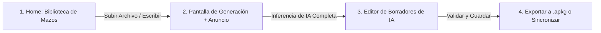

# Manual de Arquitectura Técnica, Diseño de Interfaz y Monetización: Generador de Flashcards con IA Local (2026)

Este manual proporciona las especificaciones técnicas, el diseño de base de datos, la arquitectura de interfaz y la estrategia de monetización para el desarrollo de un **Generador de Tarjetas Didácticas (Flashcards) de Nicho** para Android (Kotlin/Jetpack Compose), integrado con el ecosistema de Anki y respaldado por Firebase para la gestión ligera de usuarios bajo cumplimiento estricto de la LOPD (GDPR).

---

## PARTE I: MANUAL DE ARQUITECTURA TÉCNICA Y BASE DE DATOS

### 1. Arquitectura de Inferencia de IA Local (LiteRT-LM)

Para garantizar un costo operativo de cero dólares y máxima privacidad, la aplicación ejecuta modelos de lenguaje pequeños (SLMs) directamente en el dispositivo móvil del usuario.

#### 1.1. Configuración de dependencias (Gradle)
La suite *MediaPipe LLM Inference API* se encuentra en modo de solo mantenimiento. Google recomienda oficialmente migrar todos los proyectos de Android a la API de **LiteRT-LM** (Kotlin) [825, 837]. 
Agregue la siguiente dependencia en el archivo `build.gradle.kts` de su módulo `:app` o `:ai`:

```kotlin
dependencies {
    // Implementación oficial de LiteRT-LM para Android (Kotlin/Java API)
    implementation("com.google.mediapipe:tasks-genai:0.10.27") [826]
}
```

#### 1.2. Estrategia de Descarga Dinámica Over-The-Air (OTA)
Debido a que los modelos de lenguaje cuantizados pesan entre 1.5 GB y 3 GB, es técnicamente inviable e ilegal empaquetarlos directamente dentro de la APK de Google Play [826]. 
*   **Modelo recomendado:** **Gemma-3 1B IT** (cuantizado a 4 bits, formato `.task` o `.litertlm`) [826, 830]. Requiere aproximadamente 2 GB de RAM libre para ejecutarse y ofrece una paridad excelente siguiendo formatos estructurados de salida [826].
*   **Flujo OTA:** Al iniciar la aplicación por primera vez, el sistema descarga de forma segura el modelo desde un CDN (por ejemplo, Hugging Face o Cloudflare) utilizando `DownloadManager` de Android y guarda el archivo en el directorio de almacenamiento interno privado:
    `context.filesDir.absolutePath + "/llm/gemma-3-1b-it-q4.task"`.

#### 1.3. Inicialización segura en Kotlin
La inicialización del motor de inferencia local requiere especificar la ruta física absoluta del modelo descargado. Es mandatorio ejecutar este proceso fuera del hilo de interfaz de usuario principal (UI Thread) para evitar bloqueos del sistema o excepciones *Application Not Responding* (ANR) [838, 862].

```kotlin
import com.google.mediapipe.tasks.genai.llminference.LlmInference
import com.google.mediapipe.tasks.genai.llminference.LlmInferenceOptions
import kotlinx.coroutines.Dispatchers
import kotlinx.coroutines.withContext

class LocalLLMManager(private val context: Context) {
    private var llmInference: LlmInference? = null

    suspend fun initializeModel(modelPath: String) = withContext(Dispatchers.IO) {
        try {
            val options = LlmInferenceOptions.builder()
                .setModelPath(modelPath) // Ruta local en context.filesDir [827]
                .setMaxTokens(1024)      // Límite de contexto para preservar RAM [829]
                .setTemperature(0.2f)    // Temperatura baja para mantener estructura estricta [829]
                .setMaxTopK(64)          // Filtrado probabilístico de tokens [827]
                .build()
            
            llmInference = LlmInference.createFromOptions(context, options) [827]
        } catch (e: Exception) {
            e.printStackTrace()
        }
    }

    suspend fun generateFlashcardsStream(prompt: String, onTokenGenerated: (String) -> Unit) = withContext(Dispatchers.Default) {
        llmInference?.let { inference ->
            // Inferencia asíncrona por flujo de tokens (Streaming) [828, 909]
            inference.generateResponseAsync(prompt) { partialResult, done ->
                onTokenGenerated(partialResult)
            } [828]
        }
    }
}
```

---

### 2. Estructura de Base de Datos y Compilación Offline de Archivos `.apkg`

Un archivo `.apkg` de Anki es físicamente un archivo **ZIP comprimido** [389, 761] que contiene:
1.  Un archivo de base de datos relacional SQLite denominado **`collection.anki2`** (el esquema de la colección de Anki) [105, 389].
2.  Un diccionario plano JSON denominado **`media`** [389], que mapea los índices internos del mazo con los nombres reales de los archivos multimedia comprimidos en el ZIP [392].

#### 2.1. Estructura física en el ZIP
```text
archivo.apkg (ZIP) [389, 761]
 ├── collection.anki2  <-- Base de datos SQLite relacional [105, 389]
 ├── 0                 <-- Archivo de imagen o sonido (renombrado a entero secuencial) [392]
 ├── 1                 <-- Otro recurso multimedia comprimido [392]
 └── media             <-- Archivo JSON plano: {"0": "imagen1.jpg", "1": "pronunciacion.mp3"} [389, 392]
```

#### 2.2. Esquema relacional interno de Anki (`collection.anki2`)
Para compilar la base de datos relacional SQLite de forma nativa en Kotlin (sin necesidad de intérpretes de Python), se debe instanciar un motor de SQLite ligero [392]. Las tablas fundamentales que se deben poblar son:

```sql
-- TABLA DE NOTAS: Contiene los datos crudos (hechos) [126, 1157]
CREATE TABLE notes (
    id integer primary key,      -- Epoch en milisegundos de la creación [108]
    guid text not null,          -- ID único global (String aleatorio de 10 caracteres) [126, 391]
    mid integer not null,        -- ID del Note Type / Modelo [108]
    mod integer not null,        -- Fecha de última modificación (Epoch en segundos) [108]
    usn integer not null,        -- Número de secuencia de actualización (usar -1 para forzar sync) [108]
    tags text not null,          -- Etiquetas separadas por espacios [125, 126]
    flds text not null,          -- Campos separados por el carácter separador de unidad ASCII  [108]
    sfld text not null,          -- Campo de ordenamiento (texto plano del primer campo) [108, 1098]
    csum integer not null,       -- Checksum de verificación de datos [126]
    flags integer not null,      -- Banderas de Anki [126]
    data text not null           -- Datos opcionales vacíos [126]
);

-- TABLA DE TARJETAS: Representa lo que el usuario repasa [108, 1157]
CREATE TABLE cards (
    id integer primary key,      -- ID de la tarjeta (milisegundos Epoch) [108]
    nid integer not null,        -- Enlace relacional con notes.id [108]
    did integer not null,        -- Enlace relacional con el ID del mazo [108]
    ord integer not null,        -- Índice de la plantilla de tarjeta (0 = frontal, 1 = reversa) [108]
    mod integer not null,        -- Modificado (milisegundos) [108]
    usn integer not null,        -- Sync USN (-1 para cambios locales) [108]
    type integer not null,       -- 0=Nueva, 1=Aprendizaje, 2=Repaso, 3=Reaprendizaje [108]
    queue integer not null,      -- Cola de repaso (-1=Suspendida, 0=Nueva, 1=Aprendizaje, 2=Repaso) [108]
    due integer not null,        -- Fecha o momento de vencimiento [108]
    ivl integer not null,        -- Intervalo del planificador de repetición [108]
    factor integer not null,     -- Factor de facilidad de repaso [108]
    reps integer not null,       -- Número total de repasos realizados [108]
    lapses integer not null,     -- Número de fallos acumulados en la tarjeta [108]
    left integer not null,       -- Repeticiones restantes para graduarse de la cola [108]
    odue integer not null,       -- Due original [108]
    odid integer not null,       -- Mazo original en decks filtrados [108]
    flags integer not null,      -- Banderas visuales [108]
    data text not null           -- Texto auxiliar [108]
);

-- TABLA DE COLECCIÓN: Registro único que almacena metadatos y configuraciones JSON [108]
CREATE TABLE col (
    id integer primary key,      -- Clave primaria estática (típicamente 1) [108]
    crt integer not null,        -- Fecha de creación de la colección (segundos) [108]
    mod integer not null,        -- Última modificación de metadatos (milisegundos) [108]
    scm integer not null,        -- Schema modification (timestamp en milisegundos) [108]
    ver integer not null,        -- Versión del esquema [108]
    dty integer not null,        -- Reservado descontinuado (usar 0) [108]
    usn integer not null,        -- Sync USN de la colección [108]
    ls integer not null,         -- Último timestamp de sincronización [108]
    conf text not null,          -- Configuración global en JSON plano [108]
    models text not null,        -- Modelos (Note Types) registrados en formato JSON [108]
    decks text not null,         -- Mazos configurados con sus metadatos en formato JSON [108]
    dconf text not null,         -- Configuración de intervalos de mazos en JSON [108]
    tags text not null           -- Cache de etiquetas indexadas en JSON [108]
);
```

#### 2.3. Prevención de Duplicados en Re-Importaciones
Para evitar la duplicación de modelos y notas durante actualizaciones del mazo en el dispositivo del usuario:
1.  **GUID Estable:** El campo `notes.guid` **no debe generarse aleatoriamente** en cada exportación [391]. Implemente una función hash criptográfica (SHA-256) en Kotlin que use como semilla el ID único de origen de la lección o dato procesado:
    ```kotlin
    fun generateStableGuid(sourceText: String): String {
        val digest = MessageDigest.getInstance("SHA-256")
        val hash = digest.digest(sourceText.toByteArray(Charsets.UTF_8))
        // Codificar el hash en formato Base64 simplificado de 10 caracteres compatible con Anki [126, 391]
        return Base64.encodeToString(hash, Base64.NO_PADDING or Base64.NO_WRAP).take(10)
    }
    ```
2.  **ID de Modelos Fijo:** El ID de los Note Types (`mid`) y de las plantillas de visualización en el JSON de la tabla `col` deben ser estáticos y persistentes (hardcodeados en la aplicación) [391, 995]. De lo contrario, Anki creará duplicados caóticos del tipo de nota (ej. "Basic+", "Basic++") con cada importación sucesiva [19, 391].

---

### 3. Integración Nativa con AnkiDroid (ContentProvider API)

Si el usuario tiene la aplicación oficial de **AnkiDroid** instalada, podemos insertar las tarjetas directamente en su base de datos local sin obligarlo a importar archivos `.apkg` manualmente [7, 388].

#### 3.1. Configuración de Seguridad en el Manifiesto (Android 11+ / API 30+)
A partir de Android 11, es mandatorio declarar de forma explícita las intenciones de consulta externa para garantizar la visibilidad del paquete del proveedor de contenidos de AnkiDroid [27, 396]. Añada el bloque `<queries>` en su `AndroidManifest.xml` [397]:

```xml
<manifest xmlns:android="http://schemas.android.com/apk/res/android"
    xmlns:tools="http://schemas.android.com/tools"
    package="com.example.tu_app_flashcards">

    <!-- Declaración obligatoria de visibilidad de paquete en Android 11+ [396, 397] -->
    <queries>
        <package android:name="com.ichi2.anki" />
    </queries>

    <!-- Permiso requerido para interactuar con la base de datos de AnkiDroid [397, 999] -->
    <uses-permission android:name="com.ichi2.anki.permission.READ_WRITE_DATABASE" />

    <application
        tools:replace="android:label"
        android:label="@string/app_name">
        <!-- ... -->
    </application>
</manifest>
```

#### 3.2. Implementación Defensiva en Kotlin para la API de AnkiDroid
Interactuar con bases de datos externas de forma interprocesos (IPC) acarrea riesgos severos de inestabilidad [990]. Se deben manejar defensivamente dos escenarios críticos de error [1018]:
1.  **Error de Arranque en Frío:** Si AnkiDroid está cerrado o el dispositivo acaba de arrancar, la inicialización inmediata de la API lanzará una excepción de contexto nulo (`IllegalArgumentException`) [4617, 785].
2.  **Conflicto de Base de Datos Concurrente:** Si el usuario está realizando repasos en AnkiDroid en segundo plano y tu aplicación intenta realizar una inserción, SQLite lanzará una excepción `BackendInvalidInputException` ("card was modified") [513, 1019].

```kotlin
import com.ichi2.anki.api.AddContentApi
import com.ichi2.anki.api.FlashCardsContract

class DefensiveAnkiDroidConnector(private val context: Context) {
    private var apiInstance: AddContentApi? = null

    // Inicialización bajo patrón defensivo seguro
    private fun getApiSafe(): AddContentApi? {
        return try {
            // Verificar si el paquete está instalado antes de instanciar [1037]
            val packageName = AddContentApi.getAnkiDroidPackageName(context) [1036]
            if (packageName != null) {
                // Instanciar un nuevo cliente en cada llamada para mitigar contextos nulos de arranque [4617, 785]
                AddContentApi(context)
            } else {
                null
            }
        } catch (e: Exception) {
            e.printStackTrace()
            null
        }
    }

    fun addNoteToAnkiDroid(
        deckId: Long,
        modelId: Long,
        fields: Array<String>,
        tags: Set<String>
    ): Long? {
        val api = getApiSafe() ?: return null
        
        return try {
            // Inserción transaccional atómica [513, 1019]
            api.addNote(modelId, deckId, fields, tags) [1046]
        } catch (e: Exception) {
            // Capturar la excepción de base de datos bloqueada por concurrencia [513, 1019]
            if (e.message?.contains("card was modified") == true) {
                // Reintentar la operación con un retraso exponencial (Backoff)
                Thread.sleep(500)
                try {
                    api.addNote(modelId, deckId, fields, tags)
                } catch (retryException: Exception) {
                    retryException.printStackTrace()
                    null
                }
            } else {
                e.printStackTrace()
                null
            }
        }
    }
}
```

---

## PARTE II: MANUAL DE DISEÑO DE INTERFAZ, GESTIÓN DE USUARIOS Y MONETIZACIÓN

### 4. Gestión de Usuarios, Seguridad de Backend (Firebase) y LOPD (GDPR)

La privacidad es una propuesta única de valor en 2026. Al ejecutar la IA de forma estrictamente local, la aplicación cumple por defecto (*Privacy by Design*) con los requerimientos de la **LOPD / GDPR** [69, 594, 600]: los datos médicos, apuntes confidenciales y textos sensibles del usuario nunca se transmiten a servidores externos [442, 600]. 

#### 4.1. Configuración de Firebase
Firebase se utilizará únicamente como una capa ligera de autenticación, control de integridad de la APK y almacenamiento de metadatos no sensibles.

```text
Estructura NoSQL de Cloud Firestore (Lógica LOPD Compliant)
users (Colección)
 └── {userId} (Documento de identificación de usuario)
      ├── registeredAt: Timestamp (Fecha de alta) [922]
      ├── isPremium: Boolean (Estado de la suscripción sincronizado por webhook) [922]
      ├── dailyUsageCount: Integer (Métricas de uso agregado, sin apuntes)
      └── aiModelPreset: String (Ej. "Gemma-3-1b-it") [922, 932]
```
*   **Aislamiento absoluto:** Nunca almacene en Firestore los apuntes, documentos de texto o PDFs cargados por el usuario. Al mantenerse en el almacenamiento interno del dispositivo, eliminas la responsabilidad de cifrar y auditar grandes repositorios de datos personales en la nube bajo la LOPD.

#### 4.2. Blindaje del Backend con App Check y Play Integrity
Para evitar la piratería de tus funciones premium y denegar el acceso a APIs de Firebase a clientes fraudulentos o emuladores modificados, es mandatorio implementar **Firebase App Check** respaldado por **Play Integrity** de Google [932]:

```kotlin
import com.google.firebase.appcheck.FirebaseAppCheck
import com.google.firebase.appcheck.playintegrity.PlayIntegrityAppCheckProviderFactory

class SecurityBootstrapper {
    fun initializeAppCheck() {
        val firebaseAppCheck = FirebaseAppCheck.getInstance()
        // Forzar autenticación criptográfica de la APK con firma original de Google Play Store [932]
        firebaseAppCheck.installAppCheckProviderFactory(
            PlayIntegrityAppCheckProviderFactory.getInstance()
        )
    }
}
```

---

### 5. Manual de Diseño de la Interfaz (Jetpack Compose)

La interfaz se estructura bajo una línea estética moderna con enfoque utilitario y navegación reactiva mediante un patrón de flujo de trabajo lineal.

#### 5.1. Flujo de Navegación del Usuario


#### 5.2. UI de Edición de Borradores de IA (*Drafting / Quality Workflow*)
Para combatir las alucinaciones inherentes de la IA local, el diseño visual debe obligar al usuario a un paso de "Validación y Edición" antes de guardar de forma permanente las tarjetas en su mazo [8, 413, 426].
*   **Principio de Diseño:** La IA genera un borrador interactivo editable en pantalla. Cada tarjeta cuenta con un campo de texto activo para corregir imperfecciones conceptuales rápidamente [408, 426].

```kotlin
@Composable
fun FlashcardDraftEditorScreen(
    drafts: List<DraftCard>,
    onSaveToCollection: (List<DraftCard>) -> Unit
) {
    var editableDrafts by remember { mutableStateOf(drafts) }

    Column(modifier = Modifier.fillMaxSize().padding(16.dp)) {
        Text(
            text = "Revisión de Borrador de IA",
            style = MaterialTheme.typography.headlineMedium,
            fontWeight = FontWeight.Bold
        )
        Text(
            text = "La IA local puede cometer errores. Por favor, edita o elimina tarjetas antes de importarlas a Anki.", [9, 426]
            style = MaterialTheme.typography.bodyMedium,
            color = Color.Gray
        )

        LazyColumn(modifier = Modifier.weight(1f)) {
            itemsIndexed(editableDrafts) { index, card ->
                Card(modifier = Modifier.fillMaxWidth().padding(vertical = 8.dp)) {
                    Column(modifier = Modifier.padding(12.dp)) {
                        OutlinedTextField(
                            value = card.front,
                            onValueChange = { newText ->
                                editableDrafts = editableDrafts.toMutableList().apply {
                                    this[index] = card.copy(front = newText)
                                }
                            },
                            label = { Text("Anverso (Pregunta)") },
                            modifier = Modifier.fillMaxWidth()
                        )
                        Spacer(modifier = Modifier.height(8.dp))
                        OutlinedTextField(
                            value = card.back,
                            onValueChange = { newText ->
                                editableDrafts = editableDrafts.toMutableList().apply {
                                    this[index] = card.copy(back = newText)
                                }
                            },
                            label = { Text("Reverso (Respuesta)") },
                            modifier = Modifier.fillMaxWidth()
                        )
                    }
                }
            }
        }

        Button(
            onClick = { onSaveToCollection(editableDrafts) },
            modifier = Modifier.fillMaxWidth().padding(top = 16.dp)
        ) {
            Text("Guardar Baraja en Anki")
        }
    }
}
```

---

### 6. Monetización e Integración de Anuncios en Ventana de Procesamiento

Para financiar de manera recurrente el acceso gratuito, implementaremos un anuncio en formato banner o integrado exactamente en la pantalla de carga donde el procesador móvil realiza la inferencia local de IA.

#### 6.1. Justificación de UX y Hardware (Peligro de Segundo Plano)
Es imperativo alertar al usuario de que no debe minimizar la aplicación. Correr Gemma-3 1B IT localmente satura la CPU y consume entre el 60% y el 95% de la memoria unificada del teléfono [440].
*   **Low Memory Killer (LMK):** Si el usuario envía la aplicación a segundo plano durante el procesamiento, Android detectará que un proceso inactivo en segundo plano está consumiendo gigabytes de RAM y **matará inmediatamente el proceso de la aplicación para liberar memoria** [440, 870]. Esto destruirá el mazo SQLite intermedio en el que se estaba trabajando y frustrará al usuario [440].

#### 6.2. Diseño de la Interfaz de Carga de IA con Anuncio (Jetpack Compose)

```kotlin
@Composable
fun GenerationProcessingScreen(
    progressValue: Float, // Flujo reactivo del progreso real (0.0f a 1.0f)
    subTaskDescription: String, // Ej. "IA redactando tarjeta 12 de 30..."
    adMobViewContainer: @Composable () -> Unit // Contenedor nativo de AdMob
) {
    Column(
        modifier = Modifier.fillMaxSize().padding(24.dp),
        horizontalAlignment = Alignment.CenterHorizontally,
        verticalArrangement = Alignment.SpaceBetween
    ) {
        // Bloque Superior: Animación e Identidad de la App
        Column(horizontalAlignment = Alignment.CenterHorizontally) {
            Text(
                text = "Generando Baraja Didáctica",
                style = MaterialTheme.typography.titleLarge,
                fontWeight = FontWeight.Bold
            )
            Spacer(modifier = Modifier.height(8.dp))
            CircularProgressIndicator(
                progress = progressValue,
                modifier = Modifier.size(72.dp)
            )
            Spacer(modifier = Modifier.height(8.dp))
            Text(
                text = subTaskDescription,
                style = MaterialTheme.typography.bodyMedium,
                color = Color.Blue
            )
        }

        // Bloque Central: Banner de Advertencia de Hardware Obligatorio (Peligro LMK) [440, 870]
        Card(
            colors = CardDefaults.cardColors(containerColor = Color(0xFFFFF9C4)), // Amarillo de advertencia
            modifier = Modifier.fillMaxWidth().padding(vertical = 16.dp)
        ) {
            Row(modifier = Modifier.padding(16.dp)) {
                Icon(
                    imageVector = Icons.Default.Warning,
                    contentDescription = "Alerta de Hardware",
                    tint = Color(0xFFF57C00),
                    modifier = Modifier.size(32.dp).padding(end = 8.dp)
                )
                Column {
                    Text(
                        text = "¡IMPORTANTE! No minimices esta aplicación",
                        style = MaterialTheme.typography.bodyMedium,
                        fontWeight = FontWeight.Bold,
                        color = Color(0xFFD84315)
                    )
                    Text(
                        text = "Para garantizar la máxima privacidad de LOPD, las tarjetas se procesan de forma 100% local en tu teléfono. El dispositivo está utilizando toda su potencia física. Si cierras la pantalla o abres otra aplicación, el sistema operativo de Android detendrá y corromperá el procesamiento para ahorrar energía.", [440, 442, 870]
                        style = MaterialTheme.typography.labelSmall,
                        color = Color.DarkGray
                    )
                }
            }
        }

        // Bloque Inferior: Contenedor de Anuncio Monetizado (AdMob) [778]
        Column(
            horizontalAlignment = Alignment.CenterHorizontally,
            modifier = Modifier.fillMaxWidth()
        ) {
            Text(
                text = "Patrocinador - Tu apoyo financia nuestro desarrollo gratuito",
                style = MaterialTheme.typography.labelSmall,
                color = Color.LightGray
            )
            Spacer(modifier = Modifier.height(4.dp))
            Box(
                modifier = Modifier
                    .fillMaxWidth()
                    .height(100.dp)
                    .background(Color.White), // Espacio unificado reservado para el banner publicitario [778]
                contentAlignment = Alignment.Center
            ) {
                adMobViewContainer()
            }
        }
    }
}
```

---

## CONCLUSIÓN: ROADMAP DE LANZAMIENTO PARA TU MVP

Para lanzar tu negocio digital en un tiempo récord de **4 semanas** sin realizar ninguna inversión inicial, te sugerimos seguir la siguiente estrategia operativa consolidada desde tus fuentes:

1.  **Semana 1: Configuración de la Infraestructura de Cobros en la Nube:**
    *   Crea tus cuentas gratuitas en **Lemon Squeezy** o **Polar** para delegar la pesadilla legal de la recaudación y declaración automática del IVA digital internacional (MoR) de tu versión de compra única premium [528].
2.  **Semana 2: Desarrollo del Core Nivel Técnico (Android Studio):**
    *   Construye tu aplicación nativa con la interfaz en Jetpack Compose, conecta la inferencia del modelo **Gemma-3 1B IT** utilizando el runtime de **LiteRT-LM** y programa el compilador SQLite offline `.apkg` [825, 826].
3.  **Semana 3: Configuración del Embudo de Marketing Orgánico Desatendido:**
    *   Monta tu embudo lineal y landing page minimalista sin costo en **Systeme.io** [541]. Su plan gratuito te permite almacenar hasta 2,000 contactos y enviar correos de captación automatizados ilimitados [911, 917].
4.  **Semana 4: Tráfico sin Rostro con Buffer Free:**
    *   Crea tus perfiles de redes sociales y utiliza inteligencias artificiales de generación de video vertical para publicar diariamente Shorts y Reels con el gancho psicológico de la memorización masiva [538, 542]. Usa el plan gratuito de **Buffer** para programar de forma automática todos tus videos de la semana y automatizar las visitas hacia tu embudo [542].

---
*Manuales actualizados y validados con los estándares de ingeniería de software y el mercado de EdTech de 2026.*
